<p align="center">
  
</p>

<h1 align="center">DBStudio</h1>

<p align="center">
  A local database management tool built with web technologies.
</p>

<p align="center">
  English · <a href="README.zh-CN.md">简体中文</a>
</p>

## Overview

DBStudio combines a browser-based workbench with a local Java service to provide a modern SQL editing and database management experience. It runs entirely on your machine, opens in the system browser, and packages the frontend and backend into a single executable JAR.

The project currently supports MySQL 8, Oracle 19c/21c, and OceanBase in Oracle compatibility mode. Database-specific behavior is isolated behind an SPI, making it possible to add new providers without changing the editor workbench.

> DBStudio 1.0.0 is the first stable release. The project remains under active development.

## Development approach

DBStudio is developed through a **Vibe Coding** workflow, with **GPT-5.6 Sol** as the primary coding model. Project direction, requirements, review, testing, and release decisions remain human-led, while AI is used to assist implementation, refactoring, debugging, documentation, and test generation.

## Highlights

- Monaco-powered SQL editor with dialect-aware completion, diagnostics, formatting, snippets, and shortcuts
- Database object explorer for tables, views, indexes, constraints, triggers, procedures, functions, packages, sequences, synonyms, and types where supported
- Streaming query execution with cancellation, execution history, elapsed-time feedback, and transaction controls
- Virtualized result grid with paging, filtering, copying, comparison, large-value viewing, and editable result sets
- CSV import and result export workflows, plus Excel-based connection import and export
- Multiple workspaces, editor recovery, connection grouping, appearance settings, and light/dark themes
- Local credential protection through macOS Keychain or Windows Credential Manager
- Extensible database provider architecture for connection, metadata, SQL dialect, and capability differences

## Supported databases

| Database | Provider | Notes |
| --- | --- | --- |
| MySQL 8.x | MySQL Connector/J | Catalog metadata, routines, explain plans, and editable results |
| Oracle 19c / 21c | Oracle JDBC | Service Name and SID connections, schema metadata, and Oracle object types |
| OceanBase | OceanBase Client | Oracle compatibility mode |

Feature availability varies according to the capabilities of each database and JDBC driver.

## How a SQL statement runs

Each SQL editor tab owns an independent JDBC session and a single-threaded execution queue. Different tabs may run in parallel, while one tab never uses the same connection for two operations at the same time.

```mermaid
flowchart LR
    A["Monaco editor<br/>selection, current statement, or script"]
    B["Vue + RpcClient<br/>POST execution request"]
    C["REST controller<br/>validate and split by SQL dialect"]
    D["Editor session<br/>allocate executionId and serialize work"]
    E["QueryRunner + JDBC<br/>execute and read results"]
    F["Workspace WebSocket<br/>ordered, bounded event queue"]
    G["Pinia query store<br/>apply incremental updates"]
    H["ResultVirtualGrid<br/>virtualized rendering"]

    A --> B --> C --> D --> E
    E -->|"metadata and row batches"| F --> G --> H
```



The execution lifecycle is:

1. The frontend sends the selected SQL, the statement at the cursor, or the complete script to `POST /api/v1/workspaces/{workspaceId}/editors/{editorId}/executions`.
2. The server validates the workspace and editor, uses the active database dialect to select or split statements, assigns an `executionId`, and returns immediately without waiting for the query to finish.
3. The editor's `QueryRunner` executes statements in order through JDBC. It supports multiple result sets, update counts, row limits, cancellation, and transaction-state tracking.
4. Result metadata is emitted first, followed by rows in configurable batches. Ordered WebSocket events use the sequence `query.started → query.resultMeta → query.rows → query.resultComplete → query.executionComplete`.
5. A bounded workspace event queue applies backpressure when the browser cannot consume rows quickly enough, preventing unbounded result buffering.
6. The Pinia query store replaces execution and result references as batches arrive, allowing the virtualized grid to display the first rows before the complete result has been read.

Cancellation calls JDBC `Statement.cancel()`. Data-changing statements mark that editor session as transaction-dirty; commit and rollback operations enter the same serialized queue so they cannot race with an active statement.

## Local-first security

DBStudio binds its server to a random port on `127.0.0.1`. At startup it opens a one-time authenticated URL, exchanges the token for an HttpOnly `SameSite=Strict` cookie, and removes the token from the address bar.

The frontend is embedded in the executable JAR and does not require Node.js at runtime. Saved passwords are not written to SQLite or browser storage; supported operating systems use their native credential store.

## Requirements

To build DBStudio, install:

- JDK 8 or later
- Node.js 20.19 or later with npm
- Docker, only for MySQL integration tests

The packaged application only requires a Java 8 or newer JRE.

## Build

Clone the repository and run the complete verification build:

```shell
git clone https://github.com/Atomjob5/DBStudio.git
cd dbstudio
./mvnw clean verify
```

The Maven reactor installs frontend dependencies, runs Java and Vue tests, builds the web application, checks Java 8 API compatibility, and creates:

```text
server-app/target/dbstudio-server.jar
```

## Run

```shell
java -jar server-app/target/dbstudio-server.jar
```

DBStudio selects an available local port and opens the authenticated workspace in your default browser. Use **More → Exit DBStudio** to roll back open transactions, close active sessions, and stop the local service cleanly.

## Frontend development

```shell
cd editor-web
npm ci
npm run dev
```

Open `http://127.0.0.1:5173/?mock=1` to work against the development-only mock transport. Production builds ignore the mock flag.

Useful frontend commands:

```shell
npm run build
npm run test
npm run test:e2e
```

## Tests

Run the full test suite:

```shell
./mvnw clean verify
```

Unit tests and server security tests do not require Docker. MySQL integration tests use Testcontainers with pinned MySQL 8.0 and 8.4 images and cover connections, metadata, DDL/DML, transactions, routines, editable results, and CSV workflows.

## Architecture

| Module | Responsibility |
| --- | --- |
| `database-spi` | Database-neutral contracts, capabilities, metadata, dialect, and domain types |
| `database-mysql` | MySQL connection, metadata, and SQL dialect implementation |
| `database-oracle-common` | Shared Oracle-compatible metadata and dialect behavior |
| `database-oracle` | Oracle JDBC provider |
| `database-oceanbase-oracle` | OceanBase Oracle-compatible provider |
| `application-core` | Sessions, query execution, transactions, persistence, CSV, and credential storage |
| `editor-web` | Vue 3, TypeScript, Element Plus, Pinia, and Monaco frontend |
| `server-app` | Local Spring Boot REST/WebSocket service and executable JAR packaging |

## Third-party libraries

DBStudio builds on the following major direct or explicitly pinned third-party libraries. Versions are defined by [`pom.xml`](pom.xml), [`editor-web/package.json`](editor-web/package.json), and [`editor-web/package-lock.json`](editor-web/package-lock.json). Transitive dependencies are governed by their respective upstream licenses.

### Backend and database access

| Library | Usage | Source | License |
| --- | --- | --- | --- |
| Spring Boot | Local REST/WebSocket service and application packaging | [spring-projects/spring-boot](https://github.com/spring-projects/spring-boot) | Apache-2.0 |
| MySQL Connector/J | MySQL JDBC connectivity | [mysql/mysql-connector-j](https://github.com/mysql/mysql-connector-j) | GPL-2.0 with Universal FOSS Exception 1.0 |
| Oracle JDBC | Oracle JDBC connectivity | [Oracle JDBC](https://www.oracle.com/database/technologies/appdev/jdbc.html) | Oracle Free Use Terms and Conditions |
| OceanBase Connector/J | OceanBase JDBC connectivity | [oceanbase/obconnector-j](https://github.com/oceanbase/obconnector-j) | LGPL-2.1 |
| Alibaba Druid | SQL parsing and dialect support | [alibaba/druid](https://github.com/alibaba/druid) | Apache-2.0 |
| SQLite JDBC | Local application persistence | [xerial/sqlite-jdbc](https://github.com/xerial/sqlite-jdbc) | Apache-2.0 |
| Jackson Databind | JSON serialization and mapping | [FasterXML/jackson-databind](https://github.com/FasterXML/jackson-databind) | Apache-2.0 |
| Apache Commons CSV | CSV import and export | [apache/commons-csv](https://github.com/apache/commons-csv) | Apache-2.0 |
| Apache Commons Lang | Runtime utilities required by the data/export stack | [apache/commons-lang](https://github.com/apache/commons-lang) | Apache-2.0 |
| Apache POI | Excel connection import and export | [apache/poi](https://github.com/apache/poi) | Apache-2.0 |
| JNA | macOS Keychain and Windows Credential Manager integration | [java-native-access/jna](https://github.com/java-native-access/jna) | LGPL-2.1-or-later or Apache-2.0 |
| SLF4J | Logging facade | [qos-ch/slf4j](https://github.com/qos-ch/slf4j) | MIT |

### Frontend

| Library | Usage | Source | License |
| --- | --- | --- | --- |
| Vue | Frontend application framework | [vuejs/core](https://github.com/vuejs/core) | MIT |
| Element Plus and Icons | UI components and icons | [element-plus/element-plus](https://github.com/element-plus/element-plus) | MIT |
| Pinia | Frontend state management | [vuejs/pinia](https://github.com/vuejs/pinia) | MIT |
| Monaco Editor | SQL editing experience | [microsoft/monaco-editor](https://github.com/microsoft/monaco-editor) | MIT |
| Vite and Vue Plugin | Frontend development and production builds | [vitejs/vite](https://github.com/vitejs/vite), [vitejs/vite-plugin-vue](https://github.com/vitejs/vite-plugin-vue) | MIT |
| TypeScript | Static type checking | [microsoft/TypeScript](https://github.com/microsoft/TypeScript) | Apache-2.0 |
| unplugin-vue-components | Vue component auto-import | [unplugin/unplugin-vue-components](https://github.com/unplugin/unplugin-vue-components) | MIT |

### Testing

| Library | Usage | Source | License |
| --- | --- | --- | --- |
| JUnit 5 | Java unit and integration tests | [junit-team/junit5](https://github.com/junit-team/junit5) | EPL-2.0 |
| Testcontainers for Java | MySQL container-based integration tests | [testcontainers/testcontainers-java](https://github.com/testcontainers/testcontainers-java) | MIT |
| Vitest | Frontend unit tests | [vitest-dev/vitest](https://github.com/vitest-dev/vitest) | MIT |
| Vue Test Utils | Vue component tests | [vuejs/test-utils](https://github.com/vuejs/test-utils) | MIT |
| happy-dom | Browser environment for unit tests | [capricorn86/happy-dom](https://github.com/capricorn86/happy-dom) | MIT |
| Playwright | End-to-end browser tests | [microsoft/playwright](https://github.com/microsoft/playwright) | Apache-2.0 |

## Contributing

Issues and pull requests are welcome. Before submitting a change, run `./mvnw clean verify` and keep database-specific behavior inside the appropriate provider module whenever possible.

## License

DBStudio's original source code is released under the [Apache License 2.0](LICENSE). Bundled and referenced third-party components remain subject to their respective licenses listed above.
