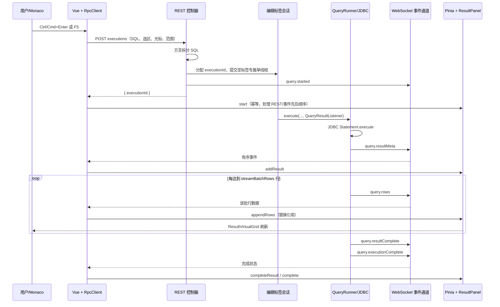

# SQL 执行与结果集流转说明

本文说明 DBStudio 从用户发起 SQL 执行，到浏览器结果面板展示数据的实际调用链。当前实现面向本机单用户 MySQL 场景：控制命令使用 REST，执行过程和结果数据使用 WebSocket 单向事件推送。

## 1. 参与组件与职责

| 组件 | 位置 | 职责 |
| --- | --- | --- |
| Vue 应用与 Monaco | `editor-web` | 获取编辑器内容、发起执行、接收事件、维护界面状态并渲染结果。 |
| `RpcClient` | `editor-web/src/bridge/rpc.ts` | 将 `query.execute` 映射为 REST 请求；维护工作区 WebSocket 并分发事件。 |
| `DbStudioApiController` | `server-app` | 校验工作区和编辑标签，拆分 SQL，创建结果监听器，返回 `executionId`。 |
| `EditorSessionRegistry` | `application-core` | 为每个 SQL 标签维护独立的 `QueryRunner`、JDBC 会话和当前执行 ID。 |
| `QueryRunner` | `application-core` | 在标签专属单线程中执行 JDBC 语句、读取结果集、按批次通知监听器。 |
| `WorkspaceEventChannel` | `server-app` | 将事件序列化为 JSON，放入有界队列并按顺序发送给浏览器。 |
| Pinia Query Store 与 `ResultPanel` | `editor-web` | 以不可变方式替换执行/结果引用，驱动 `ResultVirtualGrid` 及时刷新。 |

一个浏览器标签对应一个 `Workspace`；一个 SQL 编辑标签对应一个 `EditorSession`，也对应一个独立 JDBC 会话。不同编辑标签可以并行执行；同一个标签同一时刻只允许一个活动查询。

## 2. 请求与事件通道

执行请求使用 REST：

```text
POST /api/v1/workspaces/{workspaceId}/editors/{editorId}/executions
```

请求体的关键字段为：

| 字段 | 含义 |
| --- | --- |
| `text` | Monaco 当前 Model 的完整 SQL 文本。 |
| `selectedText` | 有选区时执行选区。 |
| `cursorOffset` | 没有选区且非脚本执行时，用于找出光标所在语句。 |
| `scope` | `script` 时拆分并顺序执行全部脚本，否则执行当前语句。 |
| `stopOnError` | 为 `true` 时遇到失败语句停止后续语句。 |

REST 接口只负责安排任务并尽快返回：

```json
{ "executionId": "c0f5..." }
```

结果不通过该 HTTP 响应返回。浏览器启动时已连接：

```text
GET ws://127.0.0.1:{port}/api/v1/events?workspaceId={workspaceId}
```

WebSocket 事件统一格式如下：

```json
{
  "version": 1,
  "type": "query.rows",
  "payload": {}
}
```

这使 HTTP 请求无需等待数据库查询和完整结果集读取，首个结果批次一经读取即可送到页面。

## 3. 执行时序



`query.started` 可能先于 REST 响应到达，也可能后到。因此前端 `QueryStore.start` 对相同 `editorId + executionId` 是幂等的，不会因为第二次调用清空已经到达的结果。

## 4. 后端处理细节

### 4.1 SQL 选择与调度

控制器根据请求选择执行范围：优先执行 `selectedText`；`scope=script` 时由数据库方言拆分脚本；其余情况通过 `cursorOffset` 找到光标所在语句。没有可执行语句时返回 `EMPTY_SQL`。

`EditorSessionRegistry` 先检查该标签是否已有活动执行；有则返回 `QUERY_BUSY`。通过检查后立即生成 UUID，记录为 `activeExecutionId`，发布 `query.started`，随后将工作交给该 `QueryRunner` 的单线程执行器。这样同一 JDBC Connection 不会被两个语句并发使用。

### 4.2 JDBC 执行和多结果集

`QueryRunner` 对每条已拆分 SQL 创建 JDBC `Statement`，设置：

- `JDBC_FETCH_SIZE = 500`：数据库驱动每次抓取的行数提示，固定值，不受界面设置影响。
- `Statement.setMaxRows(maxRows + 1)`：多读一行用于判断是否截断。

执行后通过 `Statement.getMoreResults(Statement.CLOSE_CURRENT_RESULT)` 处理存储过程或多语句产生的多个结果。每个结果都有从 0 开始的 `resultIndex`，前端据此生成结果标签。

对查询结果，读取列标签后先发送 `query.resultMeta`，其中包含 SQL、语句类型、列名和空的 `rows`。对 DML 等没有结果集的语句，也会发送 `query.resultMeta` 和 `query.resultComplete`，最后以 `updateCount` 表示影响行数。

值转换为适合 UI 的字符串：`NULL` 保持为 JSON `null`，二进制和 BLOB 以 `0x` 十六进制显示，CLOB 按 `result.clobMaxCharacters` 最多读取指定字符数，避免单个大字段无限占用内存。完整大字段查看/下载仍通过独立的流式通道读取。

### 4.3 最大展示行数与推送批次

这些参数相互独立，并在**每个结果集开始读取时**取快照，因此执行过程修改设置只影响下一次执行。

| 设置键 | 默认值 | 合法范围 | 作用 |
| --- | ---: | ---: | --- |
| `result.maxRows` | 1000 | 1–100000 | 单个结果集允许读取、保存在执行快照并发送到前端的最大行数。 |
| `result.streamBatchRows` | 100 | 1–1000 | 一条 `query.rows` WebSocket 事件最多携带的行数。 |
| `result.clobMaxCharacters` | 10000 | 1–1000000 | 结果展示链路中每个 CLOB/NCLOB 最多读取的字符数；修改后对下一次读取生效。 |
| `result.scrollOptimizationBufferScreens` | 1 | 0.5 - 3，步长 0.5 | 结果虚拟表格在可视区域四周额外渲染的屏数。 |

读取循环的规则如下：

1. 每读到一行，同时加入后端结果快照和当前 WebSocket 批次。
2. 当前批次达到 `streamBatchRows` 时，立即发送一条 `query.rows`。
3. 读到 `maxRows` 行后，继续尝试读取一行；如果仍有数据则标记 `truncated=true` 并停止读取展示数据。
4. 查询结束或被展示上限截断时，未满批的行仍立即发送，绝不等待凑满一批。
5. `query.resultComplete` 带回 `truncated`、耗时、影响行数及错误信息。

因此，批次调小通常能加快首屏出现，但会增加 JSON 序列化、WebSocket 消息和前端状态更新次数；调大能降低事件数量，但首批展示可能更晚。完整 CSV 导出会重新建立 JDBC 会话并流式读取 SQL，完全不受这两个展示参数限制。

### 4.4 事件顺序与背压

同一工作区的 `WorkspaceEventChannel` 维护容量为 128 的 `ArrayBlockingQueue` 和单独的发送线程。事件按进入队列的顺序发送，因此一个结果集的正常顺序为：

```text
query.started
→ query.resultMeta
→ query.rows（0 到多批）
→ query.resultComplete
→ query.executionComplete
```

队列满时生产者会阻塞在 `queue.put`，从而把浏览器/WebSocket 的处理速度反压到 JDBC 读取线程，避免无限制地积压结果数据。WebSocket 临时断开时，待发送事件仍保留；浏览器在 60 秒重连窗口内重连后继续接收。窗口超时后 `Workspace` 会关闭编辑会话、取消任务并释放数据库资源。

## 5. 前端状态到表格渲染

`App.vue` 为事件安装如下映射：

| 事件 | Query Store 操作 | 页面效果 |
| --- | --- | --- |
| `query.started` | `start` | 建立执行状态、显示执行中。 |
| `query.resultMeta` | `addResult` | 出现结果标签和列定义。 |
| `query.rows` | `appendRows` | 当前结果行数和 `ResultVirtualGrid` 数据立即增加。 |
| `query.resultComplete` | `completeResult` | 显示耗时、截断标志、错误或影响行数。 |
| `query.executionComplete` | `complete` | 结束执行状态，并同步标签事务脏状态。 |

Query Store 使用 `shallowRef<Record<string, QueryExecutionState>>`，但不会原地修改 execution、result 或 rows。每收到一批行都会新建目标结果对象、`rows` 数组、`results` 数组和 execution 对象，再替换对应编辑器的引用。这样传给 `ResultPanel` 的 `execution` Prop 每批都会改变引用，Vue 可稳定触发计算属性和 `ResultVirtualGrid` 更新，同时不对每个单元格建立深层响应式代理。

`ResultPanel` 只根据当前结果的列和行渲染，始终使用单滚动容器的行列双向虚拟网格，并保留浏览器原生滚动。排序、筛选、选择和列布局共用同一套状态，排序只创建当前行数组的副本，不修改 Store 中的原始结果。结果面板中的“已截断”提示仅说明 UI 保留的行受到 `result.maxRows` 限制，不代表数据库查询本身返回的数据总量。

## 6. 取消、失败与事务

- 取消：前端以 `executionId` 请求 `DELETE /executions/{executionId}`；后端找到对应标签并调用 JDBC `Statement.cancel()`。驱动返回异常后会被归类为取消，最终仍发送结果完成和执行完成事件。
- SQL 失败：`QueryRunner` 将 JDBC 异常转换为带 `errorMessage` 的 `StatementResult`，先发送该结果的完成事件；`stopOnError=true` 时不再执行后续语句，最后的 `query.executionComplete.failed` 为 `true`。
- 事务：每个编辑标签独立维护事务脏状态。修改数据的语句会标记为脏；提交或回滚排入相同标签的单线程执行器，完成后发布 `transaction.status`。关闭脏事务标签前，前端要求用户明确提交或回滚。

## 7. 排查响应慢时的观察点

1. 浏览器开发者工具的 Network：确认执行 REST 很快返回 `executionId`，而非等待整个查询结束。
2. WebSocket Frames：确认先收到 `query.resultMeta`，再按配置大小收到 `query.rows`，最后收到完成事件。
3. 设置值：检查 `result.streamBatchRows` 是否过大导致首批等待，或过小导致高频页面更新；检查 `result.maxRows` 是否过大导致不必要的数据传输。
4. JDBC/数据库：慢 SQL、锁等待、网络延迟和大字段转换会使首个 `query.rows` 到达变慢；`JDBC_FETCH_SIZE` 固定为 500，不能通过界面设置改变。
5. 浏览器渲染：若 Frames 已持续到达而表格不变，检查 Query Store 是否保持不可变更新，以及 `ResultPanel` 是否实际接收了新的 execution 引用。
6. 背压：若 WebSocket 消费缓慢，128 条有界队列会有意阻塞 JDBC 读取，以控制内存；此时应优先检查浏览器性能与批次大小。

## 8. 相关代码入口

- [前端请求与 WebSocket 客户端](../editor-web/src/bridge/rpc.ts)
- [前端事件绑定](../editor-web/src/App.vue)
- [查询状态 Store](../editor-web/src/stores/query.ts)
- [结果面板](../editor-web/src/components/ResultPanel.vue)
- [REST 执行接口与事件组装](../server-app/src/main/java/com/dbstudio/server/DbStudioApiController.java)
- [工作区事件队列](../server-app/src/main/java/com/dbstudio/server/WorkspaceEventChannel.java)
- [编辑标签会话注册表](../application-core/src/main/java/com/dbstudio/desktop/web/EditorSessionRegistry.java)
- [JDBC 执行和流式读取](../application-core/src/main/java/com/dbstudio/desktop/query/QueryRunner.java)
